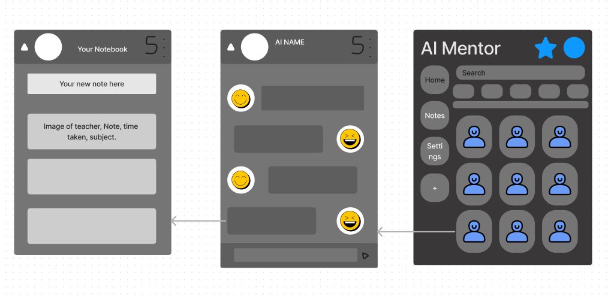
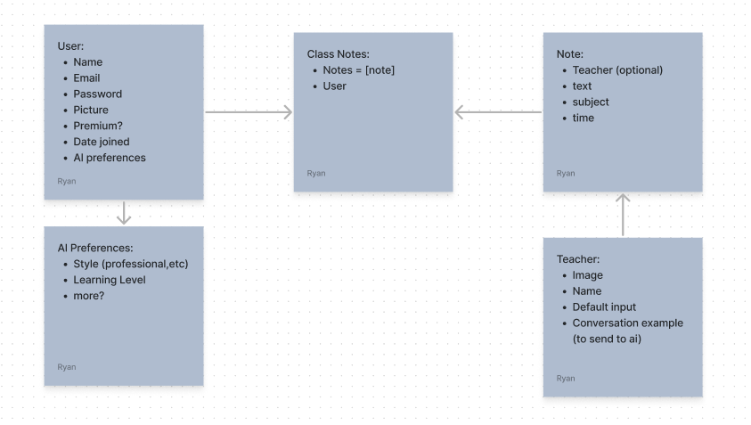
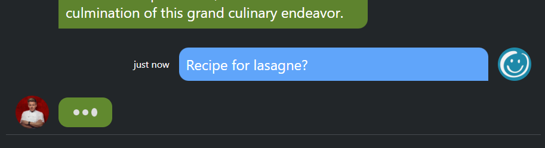

# AI University

## About the app
AI University is dedicated to harnessing the power of AI technologies to revolutionize education. Our mission is to provide a personalized, top-tier, and engaging learning experience for all. Talk to some of the industry leading professionals in whichever field you please and take notes easily to later publish to the school library. Talk to students who share your passion for AI enhanced learning and compare notes and ideas from lessons. The app is hosted on heroku for you to check out. Make an account or feel free to use the demo account if you prefer.  https://ai-university-7d83bddf0c3e.herokuapp.com/

inspiration for ui: https://www.youtube.com/watch?v=PjYWpd7xkaM&list=WL&index=7&t=3830s

---

## Main Features 
- Stripe payment for AIU premium.
- Text chat with famous professionals (AI)
- Text chat with other students (Users)
- Notebooks to compile snippets from lessons
- Publish books to the AIU Library. (With AIU premium)
- Create new ai teachers from any celebrity. (With AIU premium)

---
### Created solo in 10 days using:

## Planning

Before starting the project I created the following erd and wireframe. The app went on to include more then just the models that were planned, for example in the mvp version the messages to AI would not save to the database. I also used trello to keep track of each feature and user strory that was yet to be completed.

## AI trials and tribulations

The AI aspects of the project were a big challenge as I needed to create a prompt that would take in the user inputs and give both informative answers while being authentic to the character. 

AI generated images was a concept that caused lots of problems too. One of which was that the API would not allow certain celebrities as input, meaning the app would have to balance ai images for some characters while using urls for others. Another issue was with the prompt, after a lot of research on crafting the perfect prompt for the ai model, the images that it returned were still very inconsistent making the app feel less professional. In the end I decided to go with image urls for the teachers and may come back to image generation after the model has been improved or when the characters that it allows are less strict.

## Wins 

With this being my first app using react, I really enjoyed having reusable components. These were especially useful when moving from user chats to ai ones as I was able to reuse many of the same components making the code dry and quick to write. I also enjoyed the ability to control the state without needing the screen to refresh. This allows for many small but significant details like loading spinners, typing animations and action completed messages.

## Key Learnings

The main thing I took away from the project that could have been done better was the planning and research before starting. This would have nullified the issues with the AI generated images and saved time. It would also have helped to have better plans going into the notebooks/library side of the project, this was not in the mvp so I did not have a wireframe for the layout of the notebooks which lead that to be the worst part of the app visually.